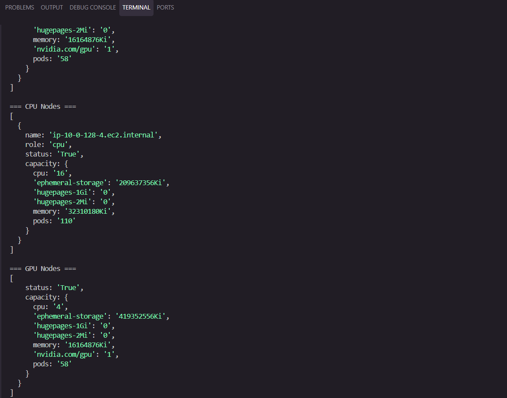
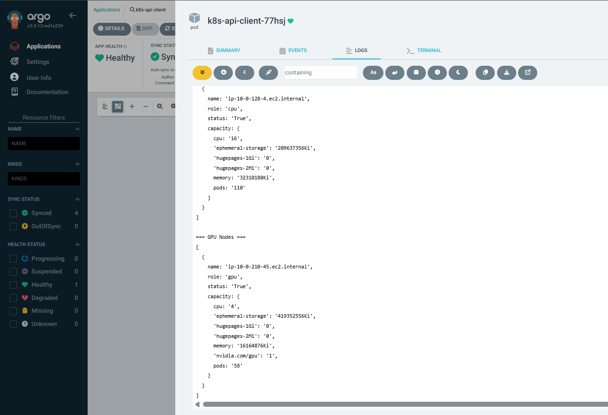

# Kubernetes API Client

Simple Node.js component that shows developers how to interact with Kubernetes API server from their applications.

## What This Component Does

This is a reference implementation showing how to:
- Connect to Kubernetes API server from Node.js applications
- Query cluster resources (nodes, pods, deployments, services)
- Work with both local development (kubeconfig) and production (in-cluster auth)
- Use the official Kubernetes JavaScript client library

## Code Structure

```
k8s_api/
├── index.js          # Main K8sClient class with API methods
├── example.js        # Usage examples
├── package.json      # Dependencies (@kubernetes/client-node)
└── README.md         # This file
```

### How It Works

The code uses the official **@kubernetes/client-node** library which is the JavaScript client for Kubernetes API.

**Constructor:**
```javascript
constructor() {
    this.kc = new k8s.KubeConfig();
    
    // Auto-detect environment
    if (process.env.KUBERNETES_SERVICE_HOST) {
        this.kc.loadFromCluster();  // Production: use ServiceAccount
    } else {
        this.kc.loadFromDefault();  // Local: use ~/.kube/config
    }
    
    this.k8sApi = this.kc.makeApiClient(k8s.CoreV1Api);      // Core resources
    this.appsApi = this.kc.makeApiClient(k8s.AppsV1Api);     // Apps resources
}
```

**API Methods:**
- `listNamespaces()` - Get all namespaces
- `listNodes()` - Get all nodes with capacity info
- `listNodesByLabel(selector)` - Filter nodes by labels (e.g., 'role=gpu')
- `listPods(namespace)` - Get pods in a namespace
- `listDeployments(namespace)` - Get deployments
- `listServices(namespace)` - Get services
- `getPodLogs(name, namespace, lines)` - Get pod logs

## API Reference

All methods are based on the official Kubernetes API:
- **Kubernetes API Docs**: https://kubernetes.io/docs/reference/generated/kubernetes-api/v1.34/
- **JavaScript Client**: https://github.com/kubernetes-client/javascript
- **Client Examples**: https://github.com/kubernetes-client/javascript/tree/master/examples

The client library methods map directly to Kubernetes REST API endpoints:
- `listNode()` → GET /api/v1/nodes
- `listNamespacedPod()` → GET /api/v1/namespaces/{namespace}/pods
- `listNamespacedDeployment()` → GET /apis/apps/v1/namespaces/{namespace}/deployments

## Installation

```bash
npm install
```

## Local Development

### Prerequisites
- Node.js installed
- kubectl configured with access to your EKS cluster
- Valid kubeconfig at `~/.kube/config`

### Configure EKS Access
```bash
aws eks update-kubeconfig --name your-cluster-name --region your-region
```

### Run Locally
```bash
node example.js
```

## Usage

```javascript
const K8sClient = require('./index');
const client = new K8sClient();

// List namespaces
const namespaces = await client.listNamespaces();

// List all nodes
const nodes = await client.listNodes();

// List nodes by label
const cpuNodes = await client.listNodesByLabel('role=cpu');
const gpuNodes = await client.listNodesByLabel('role=gpu');

// List pods
const pods = await client.listPods('default');

// List deployments
const deployments = await client.listDeployments('default');

// List services
const services = await client.listServices('default');

// Get pod logs
const logs = await client.getPodLogs('pod-name', 'default', 100);
```

## Running in EKS (Production)

When running inside EKS as a containerized application, responsibilities are split between developers and DevOps.

---

## Developer Tasks

### 1. Build and Push Docker Image

```bash
docker build -t your-registry/k8s-api-client:latest .
docker push your-registry/k8s-api-client:latest
```

### 2. Provide Required Permissions List

Tell DevOps team what Kubernetes permissions your app needs:
- List namespaces
- List/get nodes
- List/get pods
- List/get deployments
- List/get services
- Get pod logs

**Note:** The code already handles in-cluster authentication automatically. It detects if running inside Kubernetes and uses ServiceAccount tokens instead of kubeconfig.

---

## DevOps Tasks

DevOps will handle the following Kubernetes configurations:

1. Create ServiceAccount for the application
2. Configure RBAC permissions (ClusterRole and ClusterRoleBinding) based on the permissions list provided by developers
3. Update Helm chart to use the ServiceAccount in the deployment
4. Deploy the application to EKS

---

## How In-Cluster Auth Works

When a pod runs in Kubernetes with a ServiceAccount:

1. Kubernetes automatically mounts credentials at `/var/run/secrets/kubernetes.io/serviceaccount/`
2. `loadFromCluster()` reads:
   - **Token**: `/var/run/secrets/kubernetes.io/serviceaccount/token`
   - **CA Cert**: `/var/run/secrets/kubernetes.io/serviceaccount/ca.crt`
   - **Namespace**: `/var/run/secrets/kubernetes.io/serviceaccount/namespace`
3. The client uses these to authenticate with the Kubernetes API server
4. No kubeconfig file needed
